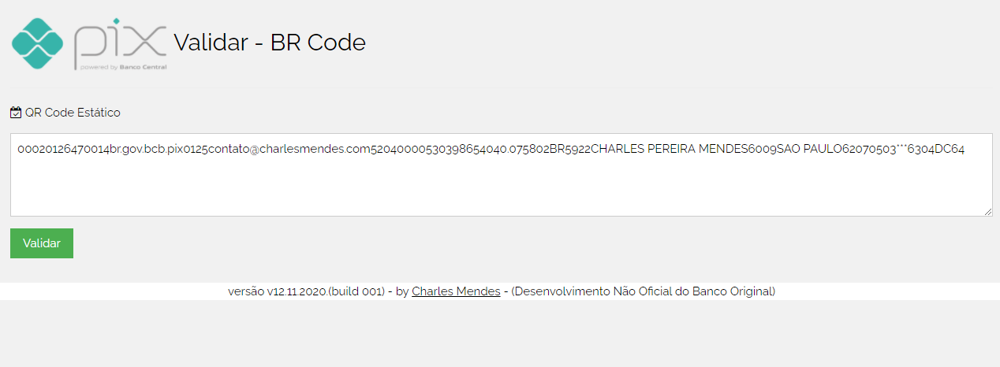
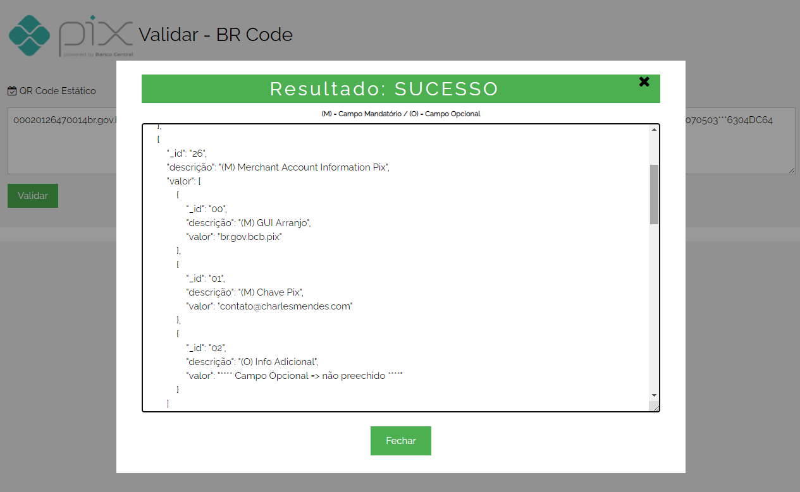
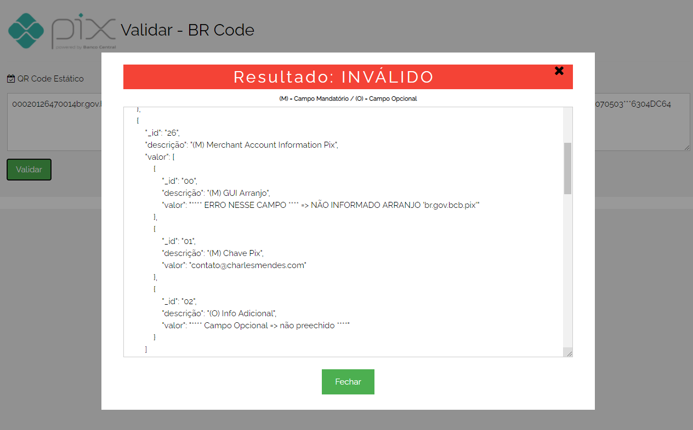
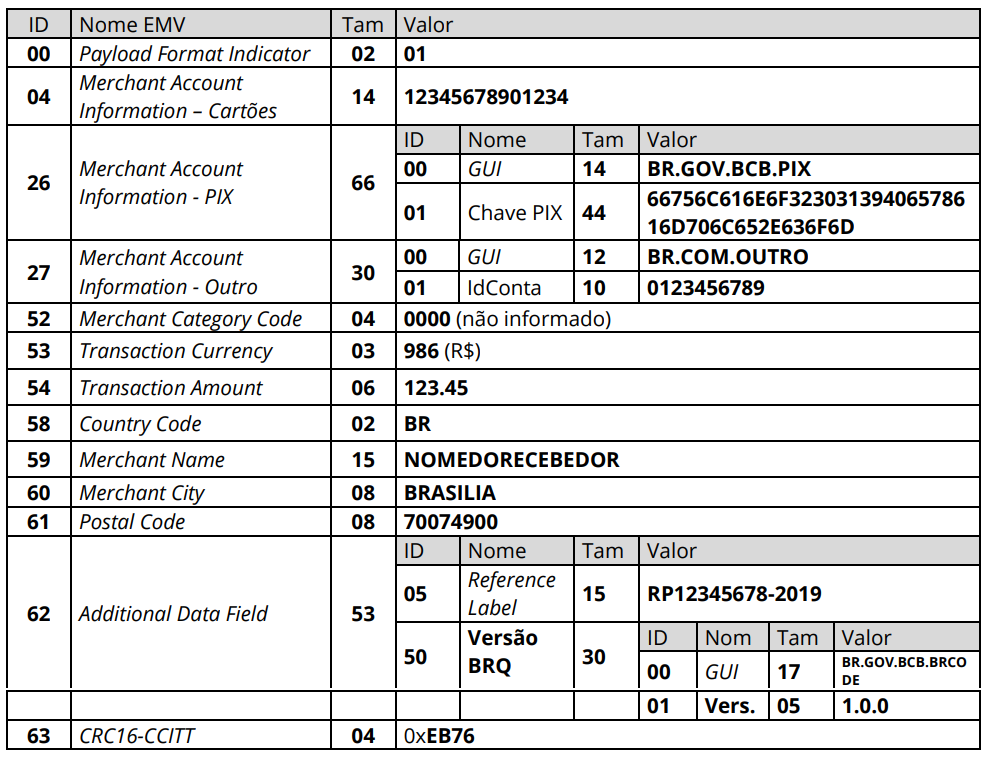

# brcode-validator
Geração, Leitura e Validação de QR Code no padrão BR Code para o Pix

# TED ou DOC? Eu vou de Pix!

## Instruções
Para usar é bem simples, basta copiar e colar o conteúdo do QR Code e clicar em "Validar", que o resultado será exibido e se houver alguma inconsistência, será informado qual o problema identificado.

## Documentação base
Documentação disponível cópia na pasta "\docs\", abaixo o link original.
* https://www.bcb.gov.br/content/estabilidadefinanceira/pix/Regulamento_Pix/II-ManualdePadroesparaIniciacaodoPix-versao2-1.pdf
* https://www.bcb.gov.br/content/estabilidadefinanceira/SiteAssets/Manual%20do%20BR%20Code.pdf
* https://github.com/mvallim/emv-qrcode/blob/master/docs/EMVCo-Merchant-Presented-QR-Specification-v1-1.pdf

### Projetos de referência
Excelentes projetos que me inspiraram:
* https://github.com/dongri/emv-qrcode
* https://github.com/mvallim/emv-qrcode

## Licença
Totalmente LIVRE! Esse código foi construído para validação de QR Code no padrão BR Code, de forma independente. 
Fique a vontade para dar um fork ou clonar o projeto, agradeço se citar minha referência.
Sugestões são bem vindas, para isso, basta abrir uma issue.
